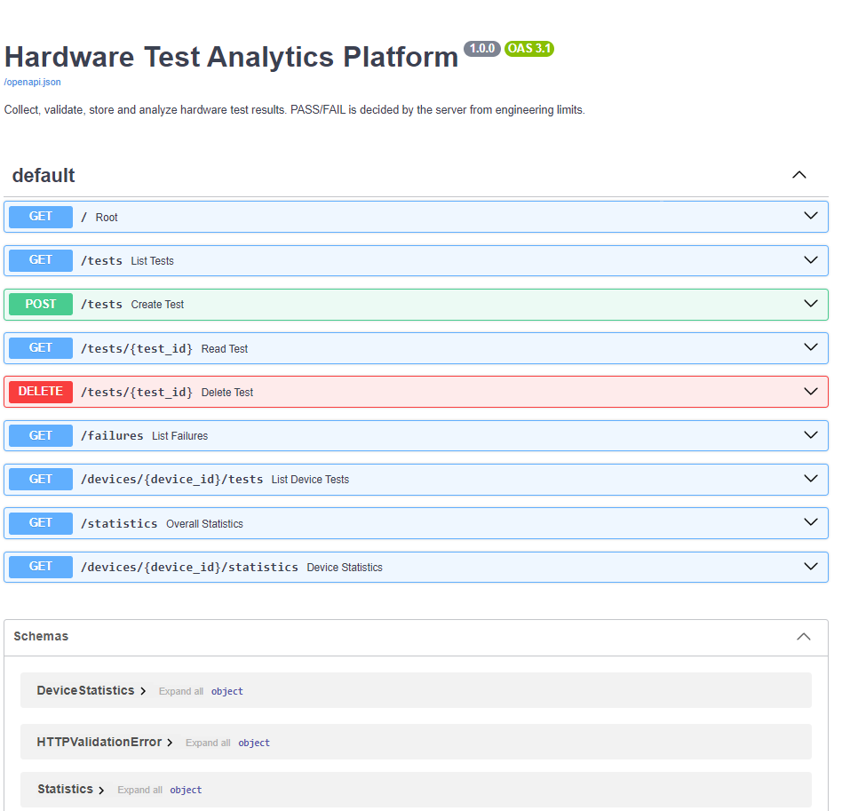
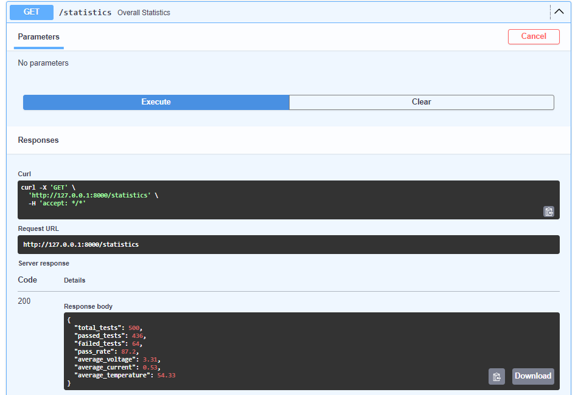

# Hardware Test Analytics Platform

A backend platform built with **Python**, **FastAPI**, and **SQLite** for collecting, validating, storing, and analyzing hardware test results.

The project models a realistic engineering test environment where multiple devices, such as `FPGA-001` to `FPGA-020`, undergo repeated electrical tests. Instead of keeping results scattered across spreadsheets, text files, and terminal output, every measurement is submitted to one central service. The service decides whether the test passed, stores the result, and turns the stored data into statistics engineers can query.

The project combines REST API development, SQL and relational databases, data validation, automated testing, continuous integration, and containerization.

> **Status:** The first version runs entirely on simulated hardware data. Reading real measurements from a microcontroller over UART/USB serial is planned but has not been implemented yet.

---

## Overview

Each test contains a device ID, a test type, and four measurements: voltage, current, temperature, and duration.

When a test is submitted, the platform:

```text
Engineer / Script
       |
       v
HTTP POST /tests
       |
       v
FastAPI (validate request format)
       |
       v
Python Evaluation Logic (check engineering limits)
       |
       v
PASS / FAIL + failure reasons
       |
       v
SQLite Database (INSERT)
       |
       v
Stored Record Returned
```

The PASS/FAIL result is never accepted from the client. It is always calculated by the server, so a submission such as `temperature = 100, result = PASS` cannot be stored as a pass.

The stored data can then be queried for individual tests, per-device history, failures, and pass-rate statistics.

---

## Features

### Test Evaluation

- Voltage must be between 3.0 V and 3.6 V
- Current must not exceed 1.0 A
- Temperature must not exceed 80 °C
- Duration must be greater than 0 seconds
- Limits are inclusive, so 3.6 V and 80.0 °C pass while 3.61 V and 80.1 °C fail
- Every failed check is recorded, not just the first one
- Multiple failures are joined into a single readable reason

For example, a test with high voltage, current, and temperature is stored with:

```text
Voltage above maximum limit (3.85 V > 3.6 V); Current above maximum limit (1.21 A > 1.0 A); Temperature above maximum limit (93.0 C > 80.0 C)
```

### REST API

- Submit a new test
- List all tests
- Retrieve one test by ID
- Delete a test entered incorrectly
- List all tests for one device
- List only failed tests
- Overall statistics
- Per-device statistics

### Data and Validation

- Input validation with Pydantic: wrong types, empty device IDs, unknown test types, missing fields, negative durations, and NaN values are rejected with HTTP 422
- Engineering validation kept separate from input validation, so `temperature = 95` is a valid request that is stored as a FAIL
- Parameterized SQL queries throughout to prevent SQL injection
- Statistics calculated in SQL using `COUNT`, `SUM`, `AVG`, and `WHERE`
- Proper HTTP status codes: 201 for creation, 204 for deletion, 404 for missing records, 422 for invalid input

### Engineering Workflow

- Simulated data generator producing 500 tests across 20 devices
- Automated tests with Pytest, including boundary tests
- GitHub Actions runs the test suite on every push
- Docker support for running the API without a local Python setup

---

## Quick Start

Create and activate a virtual environment, then install the dependencies.

```bash
python -m venv .venv
.venv\Scripts\activate
pip install -r requirements.txt
```

On Linux or macOS, activate with `source .venv/bin/activate` instead.

Optionally generate simulated test data:

```bash
python -m scripts.generate_test_data
```

Start the API:

```bash
uvicorn app.main:app --reload
```

Then open the interactive Swagger UI in a browser:

```text
http://127.0.0.1:8000/docs
```

The database file, `test_data.db`, is created automatically the first time the application starts.

---

## API Endpoints

```text
POST    /tests                           Submit a test (201, or 422 if invalid)
GET     /tests                           List all tests
GET     /tests/{id}                      Retrieve one test (404 if missing)
DELETE  /tests/{id}                      Delete a test (204, or 404 if missing)
GET     /devices/{device_id}/tests       List all tests for one device
GET     /failures                        List failed tests only
GET     /statistics                      Overall statistics
GET     /devices/{device_id}/statistics  Statistics for one device (404 if unknown)
```

Supported test types are `POWER`, `UART`, `MEMORY`, `THERMAL`, and `FUNCTIONAL`.

---

## Example

Submitting a test with a temperature above the limit:

```bash
curl -X POST http://127.0.0.1:8000/tests \
  -H "Content-Type: application/json" \
  -d '{"device_id":"FPGA-010","test_type":"THERMAL","voltage":3.29,"current":0.44,"temperature":88.3,"duration":3.2}'
```

The response:

```json
{
  "id": 501,
  "device_id": "FPGA-010",
  "test_type": "THERMAL",
  "voltage": 3.29,
  "current": 0.44,
  "temperature": 88.3,
  "duration": 3.2,
  "result": "FAIL",
  "failure_reason": "Temperature above maximum limit (88.3 C > 80.0 C)",
  "timestamp": "2026-09-20T13:01:07"
}
```

Requesting `GET /devices/FPGA-003/statistics` after generating simulated data returns something like:

```json
{
  "total_tests": 25,
  "passed_tests": 21,
  "failed_tests": 4,
  "pass_rate": 84.0,
  "average_voltage": 3.33,
  "average_current": 0.59,
  "average_temperature": 59.04,
  "device_id": "FPGA-003"
}
```

---

## Demo

### Interactive API Documentation

FastAPI generates a Swagger UI page automatically. It lists every endpoint and the request and response schemas, and lets each endpoint be tried directly in the browser.



### Overall Statistics

Calling `GET /statistics` against the simulated dataset of 500 tests returns the total, passed and failed counts, the pass rate, and the average voltage, current, and temperature.



The result shows 436 of 500 tests passing, a pass rate of 87.2 percent.

---

## Project Structure

```text
Hardware-Test-Analytics-Platform/
│
├── app/
│   ├── main.py          FastAPI routes only
│   ├── services.py      PASS/FAIL evaluation and statistics logic
│   ├── database.py      All SQL, parameterized
│   ├── schemas.py       Request and response models
│   └── config.py        Engineering limits and settings
│
├── scripts/
│   └── generate_test_data.py
│
├── tests/
│   ├── test_evaluation.py
│   ├── test_database.py
│   ├── test_api.py
│   └── test_generator.py
│
├── .github/
│   └── workflows/
│       └── tests.yml
│
├── screenshots/
│   ├── swagger_docs.png
│   └── swagger_statistics.png
│
├── Dockerfile
├── requirements.txt
├── DESIGN.md
└── README.md
```

The API layer contains no engineering rules and no SQL. `main.py` receives requests and coordinates, `services.py` decides PASS/FAIL, and `database.py` is the only file that talks to SQLite. This separation lets the evaluation logic be tested with plain function calls and no web server.

See [DESIGN.md](DESIGN.md) for the architecture and the reasoning behind the design decisions.

---

## Running the Tests

```bash
pytest
```

The suite currently contains 68 tests covering:

- Every evaluation rule, including boundary values such as 3.59 V, 3.60 V, and 3.61 V
- Multiple simultaneous failures
- Inserting, retrieving, filtering, and deleting records in SQLite
- Statistics calculations
- SQL injection attempts being treated as plain data
- Every API endpoint and its status codes
- Invalid input being rejected
- Data persisting across application restarts
- The simulated data generator

Tests run against temporary databases, so `test_data.db` is never modified.

GitHub Actions runs the same suite automatically on every push and pull request using Python 3.11, 3.12, and 3.13.

---

## Simulated Data

The generator creates 20 devices with 25 tests each:

```bash
python -m scripts.generate_test_data
```

Each device has its own small bias, so some run hotter or draw more current than others, and every measurement has a small chance of a fault being injected. The result is a realistic mix of passing and failing tests, with a pass rate of roughly 88 to 90 percent.

Useful options:

```bash
python -m scripts.generate_test_data --devices 5 --tests-per-device 10
python -m scripts.generate_test_data --seed 42
python -m scripts.generate_test_data --reset
```

`--seed` makes the output reproducible, and `--reset` clears existing results first.

---

## Docker

Build the image:

```bash
docker build -t hardware-test-analytics-platform .
```

Run the container:

```bash
docker run -p 8000:8000 -v htap-data:/data hardware-test-analytics-platform
```

The API is then available at `http://localhost:8000/docs`. The database is stored in the `/data` volume so it survives container restarts.

To load simulated data into a running container:

```bash
docker exec <container> python -m scripts.generate_test_data
```

---

## Technologies Used

- **Python**
- **FastAPI**
- **Pydantic**
- **SQLite**
- **SQL**
- **Pytest**
- **GitHub Actions**
- **Docker**
- **Git / GitHub**

---

## Concepts Demonstrated

This project provided hands-on experience with:

- REST API design and HTTP status codes
- JSON request and response handling
- Relational database design
- Primary keys, indexes, and SQL aggregate queries
- Parameterized queries and SQL injection prevention
- Input validation versus engineering validation
- Separation of concerns between API, logic, and data layers
- Unit testing and boundary testing
- API testing with a test client
- Continuous integration
- Containerization
- Technical documentation

---

## Project Purpose

The goal of this project was to build a small but complete backend system that resembles the internal tools engineering teams use to track hardware testing.

Instead of viewing test results one at a time, the platform stores everything in one place and makes it possible to ask questions such as which devices fail most often, how pass rates compare across devices, and what the average operating temperature is.

---

## Future Improvements

Potential future improvements include:

- Reading real measurements from an Arduino or other microcontroller over UART/USB serial
- Replacing SQLite with PostgreSQL
- A web dashboard for pass rates, temperature over time, and failures by device
- Authentication for submitting and deleting tests
- Different limits for different device types
- CSV export
- Search and pagination
- Detecting devices whose temperature or current is slowly increasing
- Alerts when repeated failures occur

---

## Disclaimer

This project was developed independently for educational and portfolio purposes using simulated data. It is not connected to any real production test system.
