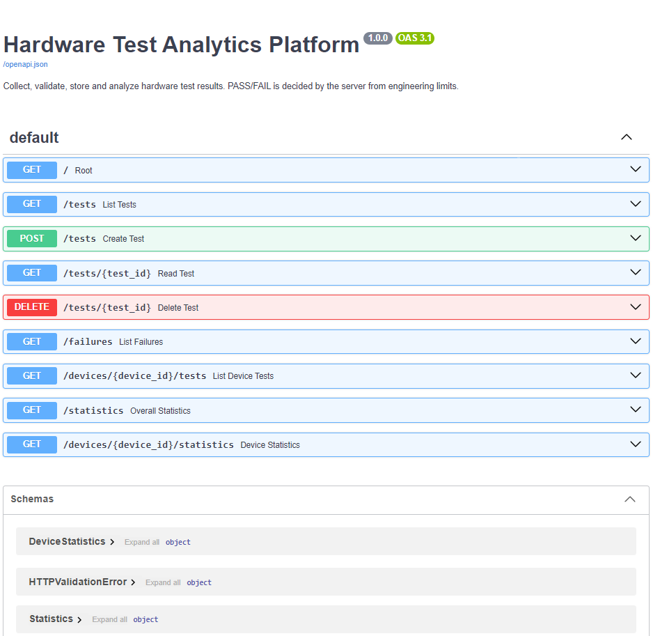
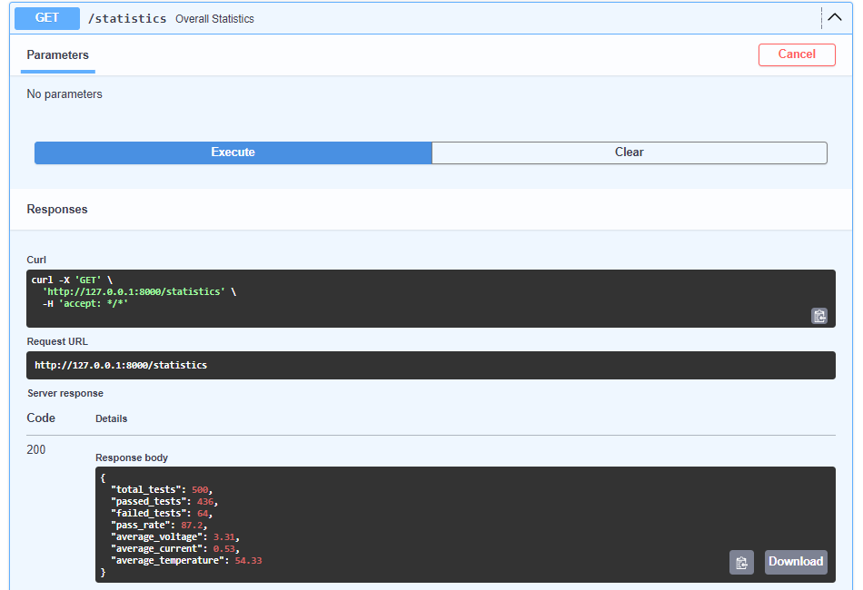

# Hardware Test Analytics Platform

A backend platform built with **Python**, **FastAPI**, and **SQL** for collecting, validating, storing, and analyzing hardware test results. It runs on either of two databases: **SQLite** by default, or **Oracle** with a **PL/SQL** package.

The project models a realistic engineering test environment where multiple devices, such as `FPGA-001` to `FPGA-020`, undergo repeated electrical tests. Instead of keeping results scattered across spreadsheets, text files, and terminal output, every measurement is submitted to one central service. The service decides whether the test passed, stores the result, and turns the stored data into statistics engineers can query.

The project combines REST API development, SQL and relational databases, Oracle PL/SQL, data validation, automated testing, continuous integration, containerization, and a data export for Power BI and Tableau.

> **Status:** The first version runs entirely on simulated hardware data. Reading real measurements from a microcontroller over UART/USB serial is planned but has not been implemented yet.

---

## Overview

Each test contains a device ID, a test type, and four measurements: voltage, current, temperature, and duration.

When a test is submitted, the platform:

```text
Engineer / Script
       |
       v
HTTP POST /tests
       |
       v
FastAPI (validate request format)
       |
       v
Python Evaluation Logic (check engineering limits)
       |
       v
PASS / FAIL + failure reasons
       |
       v
SQLite (INSERT)  or  Oracle (PL/SQL procedure)
       |
       v
Stored Record Returned
```

The PASS/FAIL result is never accepted from the client. It is always calculated by the server, so a submission such as `temperature = 100, result = PASS` cannot be stored as a pass.

The stored data can then be queried for individual tests, per-device history, failures, and pass-rate statistics.

---

## Features

### Test Evaluation

- Voltage must be between 3.0 V and 3.6 V
- Current must not exceed 1.0 A
- Temperature must not exceed 80 °C
- Duration must be greater than 0 seconds
- Limits are inclusive, so 3.6 V and 80.0 °C pass while 3.61 V and 80.1 °C fail
- Every failed check is recorded, not just the first one
- Multiple failures are joined into a single readable reason

For example, a test with high voltage, current, and temperature is stored with:

```text
Voltage above maximum limit (3.85 V > 3.6 V); Current above maximum limit (1.21 A > 1.0 A); Temperature above maximum limit (93.0 C > 80.0 C)
```

### REST API

- Submit a new test
- List all tests
- Retrieve one test by ID
- Delete a test entered incorrectly
- List all tests for one device
- List only failed tests
- Overall statistics
- Per-device statistics

### Data and Validation

- Input validation with Pydantic: wrong types, empty device IDs, unknown test types, missing fields, negative durations, and NaN values are rejected with HTTP 422
- Engineering validation kept separate from input validation, so `temperature = 95` is a valid request that is stored as a FAIL
- Parameterized SQL queries throughout to prevent SQL injection
- Statistics calculated in SQL using `COUNT`, `SUM`, `AVG`, and `WHERE`
- Proper HTTP status codes: 201 for creation, 204 for deletion, 404 for missing records, 422 for invalid input

### Two Database Backends

- SQLite is the default and needs no setup
- Oracle Database Free is the second backend, selected with `DB_BACKEND=oracle`
- The Oracle schema is normalized into three tables with primary keys, foreign keys, check constraints, and indexes
- Writes and statistics on Oracle go through a PL/SQL package; reads use two views
- Both backends sit behind one small selector, so the routes are the same for either
- Automated tests load the same 500 results into both and check that every answer matches

### Reporting

- A flat reporting view with pass, fail, and fault-type flags on both backends
- A script that exports the view to a CSV for Power BI and Tableau
- DAX measures and step-by-step build guides for both tools, with the value each KPI should show

### Engineering Workflow

- Simulated data generator producing 500 tests across 20 devices
- Automated tests with Pytest, including boundary tests
- GitHub Actions runs the test suite on every push, once without Oracle and once against an Oracle service container
- Docker support for running the API without a local Python setup, and Docker Compose for the Oracle database

---

## Quick Start

Create and activate a virtual environment, then install the dependencies.

```bash
python -m venv .venv
.venv\Scripts\activate
pip install -r requirements.txt
```

On Linux or macOS, activate with `source .venv/bin/activate` instead.

Optionally generate simulated test data:

```bash
python -m scripts.generate_test_data
```

Start the API:

```bash
uvicorn app.main:app --reload
```

Then open the interactive Swagger UI in a browser:

```text
http://127.0.0.1:8000/docs
```

The database file, `test_data.db`, is created automatically the first time the application starts.

This uses SQLite. To run on Oracle instead, see [Database Backends](#database-backends).

---

## Database Backends

The API talks to its database through one of two modules that expose the same functions. `DB_BACKEND` chooses between them.

```text
                    main.py (FastAPI routes)
                             |
                             v
                 repository.get_backend()
                  reads DB_BACKEND at call time
                             |
             +---------------+----------------+
             |                                |
             v                                v
        database.py                     oracle_db.py
     sqlite3, "?" placeholders      python-oracledb, ":name" binds
             |                                |
             v                                v
        test_data.db                  Oracle Database Free
     1 table, 1 view                3 tables, 2 views,
                                    PL/SQL package test_stats_pkg
```

| | SQLite | Oracle |
| --- | --- | --- |
| Select with | `DB_BACKEND=sqlite` (default) | `DB_BACKEND=oracle` |
| Driver | `sqlite3` from the standard library | `python-oracledb` in thin mode |
| Schema | One table, `test_results` | `devices`, `test_types`, and `test_results`, joined by foreign keys |
| Writes | Parameterized `INSERT` | PL/SQL procedure `record_test_result` |
| Statistics | One aggregate query | PL/SQL procedures returning ref cursors |
| Connections | One per operation | A small connection pool |

### Running on SQLite

Nothing to configure. Follow the Quick Start above.

### Running on Oracle

Oracle runs locally in a container from the free `gvenzl/oracle-free` image.

1. Copy `.env.example` to `.env` and set `ORACLE_PASSWORD` and `ORACLE_SYSTEM_PASSWORD` to values of your own. No credentials are stored in the repository.

2. Start the database and wait for it to report healthy:

```bash
docker compose up -d oracle
```

3. Load the simulated data. This creates the tables, views, and PL/SQL package first:

```bash
python -m scripts.generate_test_data --backend oracle --seed 42 --reset
```

4. Set `DB_BACKEND=oracle` in `.env` and start the API as usual:

```bash
uvicorn app.main:app --reload
```

To run the API in a container next to the database instead:

```bash
docker compose --profile api up -d --build
```

---

## Oracle and PL/SQL

The Oracle objects are plain SQL files in [`db/oracle`](db/oracle), applied automatically when the API starts.

The PL/SQL package `test_stats_pkg`:

| Routine | Kind | What it does |
| --- | --- | --- |
| `record_test_result` | Procedure | Validates one test, registers the device if it is new, inserts the row, and returns the new id. Raises `ORA-20001` to `ORA-20004` for invalid values |
| `device_pass_rate` | Function | Returns the pass rate of one device as a percentage, or `NULL` if it has no tests |
| `get_statistics` | Procedure | Opens two ref cursors: overall totals and averages, and the same figures per device |
| `get_device_statistics` | Procedure | Opens a ref cursor with the totals and averages for one device |

The views:

| View | What it shows |
| --- | --- |
| `v_test_report` | Every test as one flat row, with the device and test type joined in and 1/0 flags for pass, fail, and each kind of fault |
| `v_failed_tests` | The same columns for failed tests only |

See [db/oracle/README.md](db/oracle/README.md) for the tables, constraints, indexes, and error codes.

---

## API Endpoints

```text
POST    /tests                           Submit a test (201, or 422 if invalid)
GET     /tests                           List all tests
GET     /tests/{id}                      Retrieve one test (404 if missing)
DELETE  /tests/{id}                      Delete a test (204, or 404 if missing)
GET     /devices/{device_id}/tests       List all tests for one device
GET     /failures                        List failed tests only
GET     /statistics                      Overall statistics
GET     /devices/{device_id}/statistics  Statistics for one device (404 if unknown)
```

Supported test types are `POWER`, `UART`, `MEMORY`, `THERMAL`, and `FUNCTIONAL`.

---

## Example

Submitting a test with a temperature above the limit:

```bash
curl -X POST http://127.0.0.1:8000/tests \
  -H "Content-Type: application/json" \
  -d '{"device_id":"FPGA-010","test_type":"THERMAL","voltage":3.29,"current":0.44,"temperature":88.3,"duration":3.2}'
```

The response:

```json
{
  "id": 501,
  "device_id": "FPGA-010",
  "test_type": "THERMAL",
  "voltage": 3.29,
  "current": 0.44,
  "temperature": 88.3,
  "duration": 3.2,
  "result": "FAIL",
  "failure_reason": "Temperature above maximum limit (88.3 C > 80.0 C)",
  "timestamp": "2026-09-20T13:01:07"
}
```

Requesting `GET /devices/FPGA-003/statistics` after generating simulated data returns something like:

```json
{
  "total_tests": 25,
  "passed_tests": 21,
  "failed_tests": 4,
  "pass_rate": 84.0,
  "average_voltage": 3.33,
  "average_current": 0.59,
  "average_temperature": 59.04,
  "device_id": "FPGA-003"
}
```

---

## Demo

### Interactive API Documentation

FastAPI generates a Swagger UI page automatically. It lists every endpoint and the request and response schemas, and lets each endpoint be tried directly in the browser.



### Overall Statistics

Calling `GET /statistics` against the simulated dataset of 500 tests returns the total, passed and failed counts, the pass rate, and the average voltage, current, and temperature.



The result shows 436 of 500 tests passing, a pass rate of 87.2 percent. This screenshot was taken on a dataset generated without a seed. The reproducible dataset used for the dashboards (`--seed 42`) has 447 of 500 passing, a pass rate of 89.4 percent.

---

## Dashboards

The data is ready for Power BI and Tableau, but the dashboards themselves have not been built yet. This section will hold the screenshots and the public link once they are.

`bi/export_results.py` writes the reporting view to [`bi/data/test_results.csv`](bi/data/test_results.csv), one row per test:

```bash
python -m bi.export_results
```

Add `--backend oracle` to export from Oracle. Both backends produce the same file, byte for byte.

The committed CSV holds the seeded dataset: 500 tests, 447 passed, 53 failed, 17 of 20 devices with at least one failure, and `FPGA-015` the worst device at 72.0 percent.

| Tool | Prepared in the repository | Still to do by hand |
| --- | --- | --- |
| Power BI | [`measures.dax`](bi/power_bi/measures.dax) and [`BUILD_GUIDE.md`](bi/power_bi/BUILD_GUIDE.md) | Build the report in Power BI Desktop |
| Tableau Public | [`BUILD_GUIDE.md`](bi/tableau/BUILD_GUIDE.md) with the calculated fields and sheets | Build and publish the workbook |

Each guide lists the exact value every KPI should show, so a finished dashboard can be checked against the data.

### Power BI

_Screenshot placeholder: `screenshots/powerbi_dashboard.png` (not built yet)._

### Tableau Public

_Link placeholder: Tableau Public URL (not published yet)._

_Screenshot placeholder: `screenshots/tableau_dashboard.png` (not built yet)._

---

## Project Structure

```text
Hardware-Test-Analytics-Platform/
│
├── app/
│   ├── main.py          FastAPI routes only
│   ├── services.py      PASS/FAIL evaluation and statistics logic
│   ├── repository.py    Chooses the backend from DB_BACKEND
│   ├── database.py      SQLite backend, all SQL parameterized
│   ├── oracle_db.py     Oracle backend, calls the PL/SQL package
│   ├── schemas.py       Request and response models
│   └── config.py        Engineering limits and settings
│
├── db/
│   └── oracle/
│       ├── schema.sql           Tables, constraints, indexes
│       ├── views.sql            Reporting and failures views
│       ├── test_stats_pkg.sql   PL/SQL package
│       ├── drop.sql
│       └── README.md
│
├── bi/
│   ├── export_results.py        Reporting view to CSV
│   ├── data/
│   │   ├── test_results.csv
│   │   └── kpi_summary.json
│   ├── power_bi/
│   │   ├── measures.dax
│   │   └── BUILD_GUIDE.md
│   └── tableau/
│       └── BUILD_GUIDE.md
│
├── scripts/
│   └── generate_test_data.py
│
├── tests/
│   ├── conftest.py
│   ├── test_evaluation.py
│   ├── test_database.py
│   ├── test_api.py
│   ├── test_generator.py
│   ├── test_generator_cli.py
│   ├── test_reporting.py
│   ├── test_repository.py
│   ├── test_export.py
│   ├── test_oracle_sql.py
│   ├── test_oracle.py           Needs Oracle
│   └── test_backend_parity.py   Needs Oracle
│
├── .github/
│   └── workflows/
│       └── tests.yml
│
├── screenshots/
│   ├── swagger_docs.png
│   └── swagger_statistics.png
│
├── Dockerfile
├── docker-compose.yml
├── .env.example
├── requirements.txt
├── DESIGN.md
└── README.md
```

The API layer contains no engineering rules and no SQL. `main.py` receives requests and coordinates, `services.py` decides PASS/FAIL, and `database.py` and `oracle_db.py` are the only files that talk to a database. This separation lets the evaluation logic be tested with plain function calls and no web server, and it let Oracle be added without changing what any route returns.

See [DESIGN.md](DESIGN.md) for the architecture and the reasoning behind the design decisions.

---

## Running the Tests

```bash
pytest
```

The suite contains 206 tests. 124 of them need no database server. The other 82 need Oracle and are skipped, with the reason shown, when it is not running.

| | Tests run | Statement coverage |
| --- | --- | --- |
| Without Oracle | 124 passed, 82 skipped | 100% of every file except `app/oracle_db.py` (36%); 81% overall |
| With Oracle running | 206 passed | 100% of all 465 statements in `app/`, `scripts/`, and `bi/` |

To measure coverage:

```bash
pytest --cov=app --cov=scripts --cov=bi --cov-report=term-missing
```

The tests cover:

- Every evaluation rule, including boundary values such as 3.59 V, 3.60 V, and 3.61 V
- Multiple simultaneous failures
- Inserting, retrieving, filtering, and deleting records in SQLite and in Oracle
- Statistics calculations
- SQL injection attempts being treated as plain data on both backends
- Every API endpoint and its status codes
- Invalid input being rejected
- Data persisting across application restarts
- The simulated data generator and the CSV export
- Each validation error raised by the PL/SQL procedure
- Oracle check and foreign key constraints holding when the package is bypassed
- Backend parity: 37 tests load the same 500 seeded results into SQLite and Oracle and compare every record, statistic, API response, and the exported CSV

The SQLite tests run against temporary databases, so `test_data.db` is never modified. The Oracle tests rebuild the schema of `ORACLE_USER`, so reload the simulated data afterwards.

GitHub Actions runs the suite automatically on every push and pull request: on Python 3.11, 3.12, and 3.13 without Oracle, and once more against an Oracle service container, where the job fails if coverage is below 100 percent.

---

## Simulated Data

The generator creates 20 devices with 25 tests each:

```bash
python -m scripts.generate_test_data
```

Each device has its own small bias, so some run hotter or draw more current than others, and every measurement has a small chance of a fault being injected. The result is a realistic mix of passing and failing tests. Across seeds 0 to 199 the pass rate averaged 88.2 percent and ranged from 83.6 to 92.4 percent.

Useful options:

```bash
python -m scripts.generate_test_data --devices 5 --tests-per-device 10
python -m scripts.generate_test_data --seed 42
python -m scripts.generate_test_data --reset
python -m scripts.generate_test_data --backend oracle
python -m scripts.generate_test_data --seed 42 --now 2026-10-01T00:00:00
```

`--seed` makes the measurements reproducible, `--reset` clears existing results first, and `--backend` chooses the database to load. Timestamps are spread over the 30 days before the current time; `--now` fixes that time so the timestamps are reproducible too.

---

## Docker

Build the image:

```bash
docker build -t hardware-test-analytics-platform .
```

Run the container:

```bash
docker run -p 8000:8000 -v htap-data:/data hardware-test-analytics-platform
```

The API is then available at `http://localhost:8000/docs`. The database is stored in the `/data` volume so it survives container restarts.

To load simulated data into a running container:

```bash
docker exec <container> python -m scripts.generate_test_data
```

That image runs on SQLite. To run Oracle, or the API together with Oracle, use Docker Compose as described in [Database Backends](#database-backends).

---

## Technologies Used

- **Python**
- **FastAPI**
- **Pydantic**
- **SQLite**
- **Oracle Database Free**
- **PL/SQL**
- **python-oracledb**
- **SQL**
- **Pytest**
- **GitHub Actions**
- **Docker / Docker Compose**
- **Git / GitHub**

---

## Concepts Demonstrated

This project provided hands-on experience with:

- REST API design and HTTP status codes
- JSON request and response handling
- Relational database design
- Primary keys, indexes, and SQL aggregate queries
- Normalization, foreign keys, and check constraints
- PL/SQL packages, procedures, functions, exception handling, and ref cursors
- Views for reporting
- Supporting two databases behind one data-access interface
- Parameterized queries and SQL injection prevention
- Input validation versus engineering validation
- Separation of concerns between API, logic, and data layers
- Unit testing and boundary testing
- API testing with a test client
- Continuous integration
- Containerization
- Technical documentation

---

## Project Purpose

The goal of this project was to build a small but complete backend system that resembles the internal tools engineering teams use to track hardware testing.

Instead of viewing test results one at a time, the platform stores everything in one place and makes it possible to ask questions such as which devices fail most often, how pass rates compare across devices, and what the average operating temperature is.

---

## Future Improvements

Potential future improvements include:

- Reading real measurements from an Arduino or other microcontroller over UART/USB serial
- Building and publishing the Power BI and Tableau dashboards from the prepared export
- A web dashboard for pass rates, temperature over time, and failures by device
- Authentication for submitting and deleting tests
- Different limits for different device types
- Search and pagination
- Detecting devices whose temperature or current is slowly increasing
- Alerts when repeated failures occur

---

## Disclaimer

This project was developed independently for educational and portfolio purposes using simulated data. It is not connected to any real production test system.
